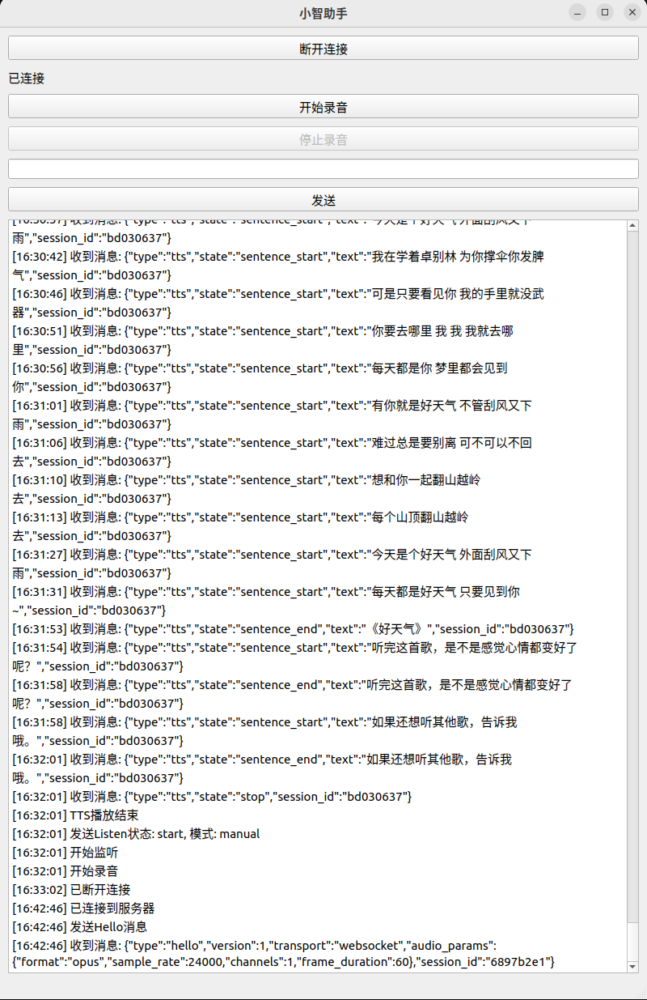

# xiaozhi_qt

20250405: QT version of XiaoZhi, featuring a simple interface with voice interaction support, suitable for algorithm research


## Features

- [x] Real-time voice dialogue functionality
- [x] Integrated Opus audio codec
- [x] Real-time WebSocket communication
- [ ] Support for multiple LLM models
- [ ] Integration of various TTS voice synthesis
- [ ] Multi-language recognition
- [ ] IOT device control
- [ ] Local VAD detection support
- [ ] Voice wake word support
- [ ] AEC support

## Usage Instructions

1. After launching the program, click the "Connect" button to connect to the server
2. Click the "Start Recording" button to begin voice dialogue
3. After speaking, the system will automatically perform speech recognition and dialogue
4. After waiting for AI response, the system will automatically play the voice reply

## Related Projects

Protocol compatible with xiaozhi-esp32, suitable for Windows client-side experience. When combined with xiaozhi-esp32-server, there are more possibilities to explore.

### xiaozhi-esp32

[xiaozhi-esp32](https://github.com/xinnan-tech/xiaozhi-esp32-server) is the companion ESP32 firmware project that works in conjunction with xiaozhi-esp32-server (open source version) to provide users with a complete intelligent voice interaction solution.

### xiaozhi-esp32-server

[xiaozhi-esp32-server](https://github.com/xinnan-tech/xiaozhi-esp32-server) 

- Supports multiple LLM language models (ChatGLM, Gemini, etc.)
- Supports various TTS voice synthesis
- Supports multi-language recognition (Mandarin, Cantonese, English, etc.)
- Supports IOT device management and intelligent control
- Provides complete WebSocket communication protocol

# Build Instructions

## Dependencies

The project depends on the following libraries:

- Qt 6/5
  - Qt::Widgets
  - Qt::Multimedia
  - Qt::WebSockets
  - Qt::Network
- Opus audio codec library
- Ogg multimedia container format library

## Build Requirements

- CMake 3.5 or higher
- C++17 compatible compiler
- pkg-config

## Installing Dependencies

Install dependencies on Ubuntu/Debian systems:

```bash
sudo apt-get update
sudo apt-get install -y \
    qt6-base-dev \
    qt6-multimedia-dev \
    qt6-websockets-dev \
    libopus-dev \
    libogg-dev \
    pkg-config
```

## Build Steps

1. Create build directory:

```bash
mkdir build
cd build
```

2. Configure project:

```bash
cmake ..
```

3. Compile project:

```bash
make
```

4. Install (optional):

```bash
sudo make install
```

## Executables

The build process will generate the following executables:

- `xiaozhi_qt`: Main program
- `test_opus_encoder`: Opus encoder/decoder test program
- `test_speaker_manager`: Speaker manager test program
- `test_sine_wave`: Sine wave test program

## Running
```bash
./build/xiaozhi_qt
```

## Configuration
### Running the Program (MAC address requires activation code if not activated)


### Login to https://xiaozhi.me/console


### Set Activation Code


# License

This project is licensed under the MIT License.

The MIT License is a permissive license that allows:
- ✅ Commercial use
- ✅ Modification
- ✅ Distribution
- ✅ Private use
The only requirement is that the original MIT license and copyright notice must be included in all copies of the software.

```text
MIT License

Copyright (c) 2024 Justa

Permission is hereby granted, free of charge, to any person obtaining a copy
of this software and associated documentation files (the "Software"), to deal
in the Software without restriction, including without limitation the rights
to use, copy, modify, merge, publish, distribute, sublicense, and/or sell
copies of the Software, and to permit persons to whom the Software is
furnished to do so, subject to the following conditions:

The above copyright notice and this permission notice shall be included in all
copies or substantial portions of the Software.

THE SOFTWARE IS PROVIDED "AS IS", WITHOUT WARRANTY OF ANY KIND, EXPRESS OR
IMPLIED, INCLUDING BUT NOT LIMITED TO THE WARRANTIES OF MERCHANTABILITY,
FITNESS FOR A PARTICULAR PURPOSE AND NONINFRINGEMENT. IN NO EVENT SHALL THE
AUTHORS OR COPYRIGHT HOLDERS BE LIABLE FOR ANY CLAIM, DAMAGES OR OTHER
LIABILITY, WHETHER IN AN ACTION OF CONTRACT, TORT OR OTHERWISE, ARISING FROM,
OUT OF OR IN CONNECTION WITH THE SOFTWARE OR THE USE OR OTHER DEALINGS IN THE
SOFTWARE.
```

## Author

Justa

## Star History

[](https://star-history.com/#Justa/xiaozhi_qt&Date) 