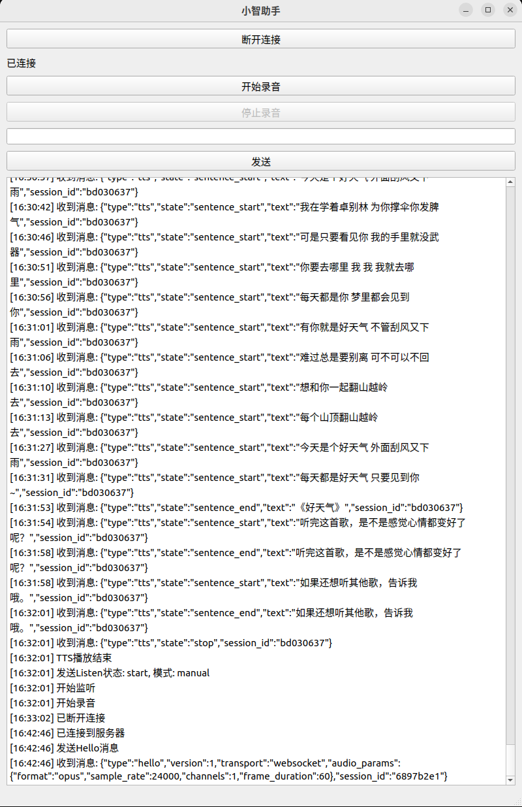

# xiaozhi_qt

20250405: QT版本的小智，简单的界面支持语音交互，适合用于算法研究


## 功能特性

- [x] 实现实时语音对话功能
- [x] 集成 Opus 音频编解码
- [x] 实现 WebSocket 实时通信
- [ ] 接入多种 LLM 模型
- [ ] 集成多种 TTS 语音合成
- [ ] 实现多语言识别
- [ ] 实现 IOT 设备控制
- [ ] 支持，本地VAD检测
- [ ] 支持，语音唤醒词
- [ ] 支持，AEC

## 使用说明

1. 启动程序后，点击"连接"按钮连接到服务器
2. 点击"开始录音"按钮开始语音对话
3. 说话完成后，系统会自动进行语音识别和对话
4. 等待 AI 回复后，系统会自动播放语音回复


## 关联项目

协议兼容 xiaozhi-esp32，适合用于windows端侧体验，当然集合xiaozhi-esp32-server，可以探索的内容更多。

### xiaozhi-esp32

[xiaozhi-esp32](https://github.com/xinnan-tech/xiaozhi-esp32-server) 是配套的 ESP32 固件项目，与 xiaozhi-esp32-server(开源版本) 配合使用，为用户提供完整的智能语音交互解决方案。

### xiaozhi-esp32-server

[xiaozhi-esp32-server](https://github.com/xinnan-tech/xiaozhi-esp32-server) 

- 支持多种 LLM 语言模型（ChatGLM、Gemini 等）
- 支持多种 TTS 语音合成
- 支持多语言识别（国语、粤语、英语等）
- 支持 IOT 设备管理和智能控制
- 提供完整的 WebSocket 通信协议

# 构建说明

## 依赖项

项目依赖以下库：

- Qt 6/5
  - Qt::Widgets
  - Qt::Multimedia
  - Qt::WebSockets
  - Qt::Network
- Opus 音频编解码库
- Ogg 多媒体容器格式库

## 构建要求

- CMake 3.5 或更高版本
- C++17 兼容的编译器
- pkg-config

## 安装依赖

在 Ubuntu/Debian 系统上安装依赖：

```bash
sudo apt-get update
sudo apt-get install -y \
    qt6-base-dev \
    qt6-multimedia-dev \
    qt6-websockets-dev \
    libopus-dev \
    libogg-dev \
    pkg-config
```

## 构建说明

1. 创建构建目录：

```bash
mkdir build
cd build
```

2. 配置项目：

```bash
cmake ..
```

3. 编译项目：

```bash
make
```

4. 安装（可选）：

```bash
sudo make install
```

## 可执行文件

构建完成后会生成以下可执行文件：

- `xiaozhi_qt`: 主程序
- `test_opus_encoder`: Opus 编解码器测试程序
- `test_speaker_manager`: 扬声器管理测试程序
- `test_sine_wave`: 正弦波测试程序

## 许可证

本项目采用 MIT 许可证。

MIT 许可证是一个宽松的许可证，允许：
- ✅ 商业使用
- ✅ 修改
- ✅ 分发
- ✅ 私人使用

唯一的要求是在软件的所有副本中都必须包含原始的 MIT 许可证和版权声明。

```text
MIT License

Copyright (c) 2024 Justa

Permission is hereby granted, free of charge, to any person obtaining a copy
of this software and associated documentation files (the "Software"), to deal
in the Software without restriction, including without limitation the rights
to use, copy, modify, merge, publish, distribute, sublicense, and/or sell
copies of the Software, and to permit persons to whom the Software is
furnished to do so, subject to the following conditions:

The above copyright notice and this permission notice shall be included in all
copies or substantial portions of the Software.

THE SOFTWARE IS PROVIDED "AS IS", WITHOUT WARRANTY OF ANY KIND, EXPRESS OR
IMPLIED, INCLUDING BUT NOT LIMITED TO THE WARRANTIES OF MERCHANTABILITY,
FITNESS FOR A PARTICULAR PURPOSE AND NONINFRINGEMENT. IN NO EVENT SHALL THE
AUTHORS OR COPYRIGHT HOLDERS BE LIABLE FOR ANY CLAIM, DAMAGES OR OTHER
LIABILITY, WHETHER IN AN ACTION OF CONTRACT, TORT OR OTHERWISE, ARISING FROM,
OUT OF OR IN CONNECTION WITH THE SOFTWARE OR THE USE OR OTHER DEALINGS IN THE
SOFTWARE.
```

## 作者

Justa

## Star History

[](https://star-history.com/#Justa/xiaozhi_qt&Date)
